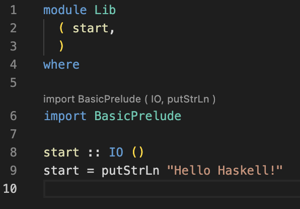

# Setup

Mac & Linux:
    - Install ghcup `curl --proto '=https' --tlsv1.2 -sSf https://get-ghcup.haskell.org | sh`
        - Install hls and stack

Windows: 
    - Install ghcup by pasting this in a PowerShell session: `Set-ExecutionPolicy Bypass -Scope Process -Force;[System.Net.ServicePointManager]::SecurityProtocol = [System.Net.ServicePointManager]::SecurityProtocol -bor 3072;Invoke-Command -ScriptBlock ([ScriptBlock]::Create((Invoke-WebRequest https://www.haskell.org/ghcup/sh/bootstrap-haskell.ps1 -UseBasicParsing))) -ArgumentList $true`    

For reference: https://www.haskell.org/ghcup/steps/

For all operating systems afterwards:
- Run `ghcup install ghc 9.0.2`
- Run `ghcup set ghc 9.0.2`
- Install vscode
- Install the Haskell VsCode extension (ID: haskell.haskell)
- Clone the repository
- Run `stack build` to download and compile all dependencies (this should take a while)
- Open the project in VSCode and open `src/Lib.hs`
- If a popup appears, choose to automatically discover tools via GHCUp (otherwise the option is probably set correctly by default)
- Write something to make the program invalid. You should get syntax highlighting in a few seconds. If not check the output of the Haskell VSCode extension.



It should look like this (there is some highlighting and some information about the import)

You can write
`-- >>> some valid Haskell expression` in the file

to run any function defined in the file and view the result

For example
`-- >>> 1 + 1` should bring up the VSCode "evaluate" option and produce `2`.

Run `stack run` in the console to build and run the application (`app/Main.hs`). This should print "Hello Haskell" to the console.

Run `stack test` to run tests (there is just one single test as a template right now). This should finish with
```
workshop> Test suite workshop-test passed
```

# Troubleshooting

## stack build fails because of zlib

Make sure the zlib C library is installed on your system.
On ubuntu, I managed to resolve the issue by running `apt-get install zlib1g`.

# Helpful tools

https://hoogle.haskell.org/ or alternatively the Haskell Spotlight extension.

https://tryhaskell.org/ if for some reason we cannot get the VSCode setup to work

# Learning material

http://learnyouahaskell.com/chapters

https://serokell.io/blog/10-reasons-to-use-haskell
